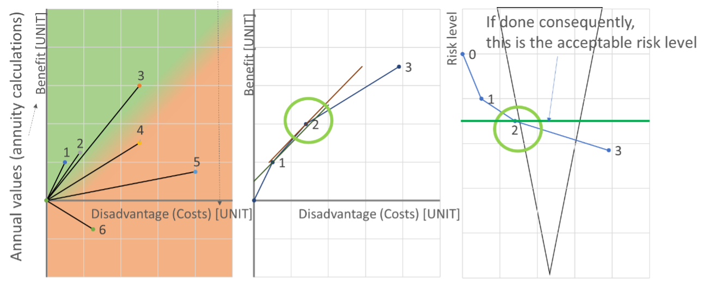

## Introduction to Acceptance Criteria
**Jochen Köhler, NTNU, Norway**

**Niels Peter Høj, HOJ Consulting, Switzerland**

The aim of the presentation is to give a short introduction to utility-based acceptance criteria.

It is established that acceptance is a decision, and a decision is a choice among alternatives. The alternative may include what to do and whether to do something or not. This decision should be made to the best of the knowledge of the decision maker. It will be necessary to include a consideration of uncertainties and to build expectation values.

The decision is supported by the von Neumann-Morgenstern utility theorem.

In terms of risk analyses the concept of ALARP (As Low AS Reasonably Practicable) is often used. The implication of the concept is that all hazards shall be identified and quantified. A risk analysis will have to be carried out assessing all effects and costs (advantages and disadvantages). All relevant actions will have to be identified and quantified as well
Consequences may have multiple units which somehow have to be aggregated with “weighting factors”, “preferences” etc, in order to have the consequences on a unified scale. Marginal costs give a guide to how much can be spent to reduce risk further. Guidance is available for these preferences, for example the LQI; Life Quality Index for giving an appropriate priority to saving lives.

The reduction of (the aggregated) risk is considered as the benefit and shall be held up against the disadvantage / cost involved in the alternative. The disadvantage /cost side shall preferably be formulated in the same units as the advantages. It will be illustrated how actions and combinations of actions can be evaluated and how this will derive the acceptable (risk) level.

The possible need for upper limits of risk and the application of limits will be discussed, It is highlighted that simplifications respecting the basic principles are useful and the methodology can be adapted to the decision problem at hand. On the other hand, some unsuitable methods of risk acceptance will be mentioned as well.

[Presentation slides](https://folk.ntnu.no/jochenk/JCSS/Files/PRES_HojKohler.pdf)